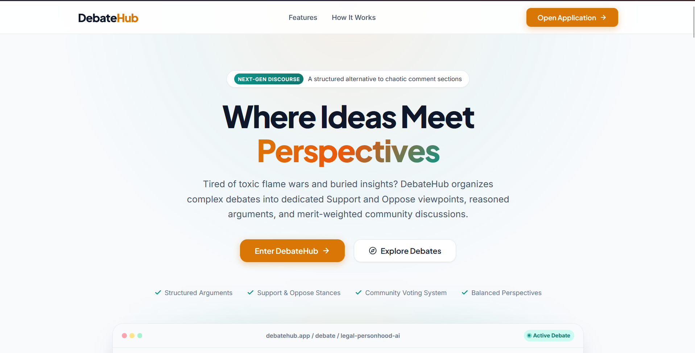
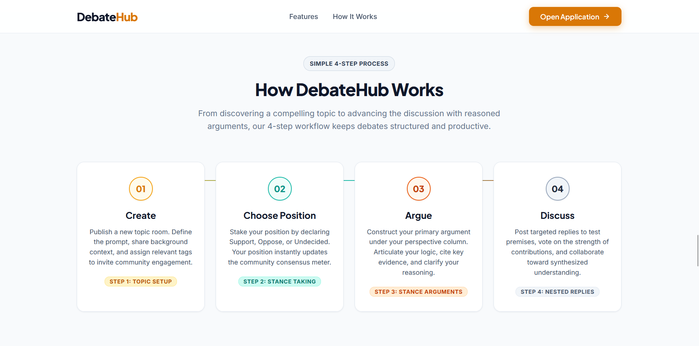
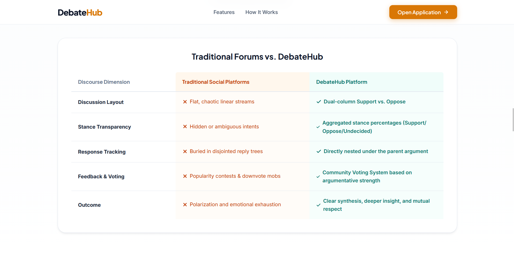
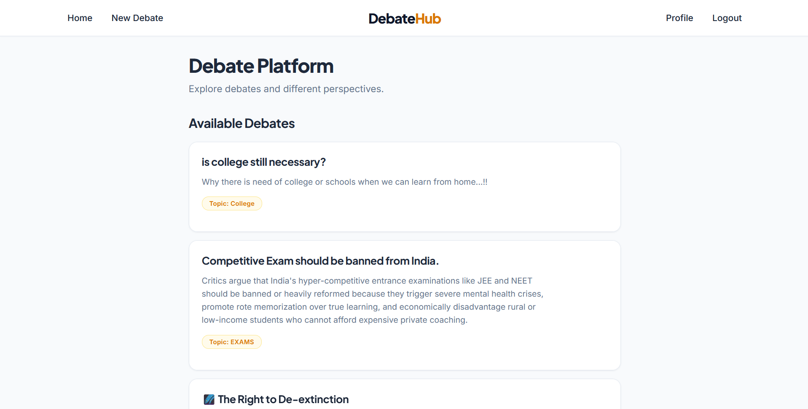
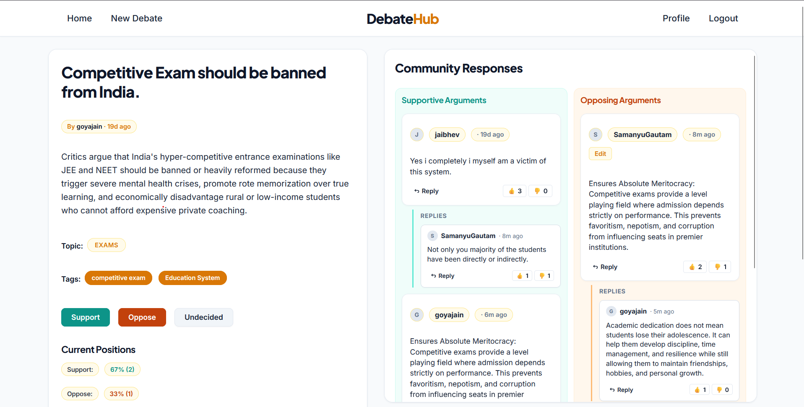
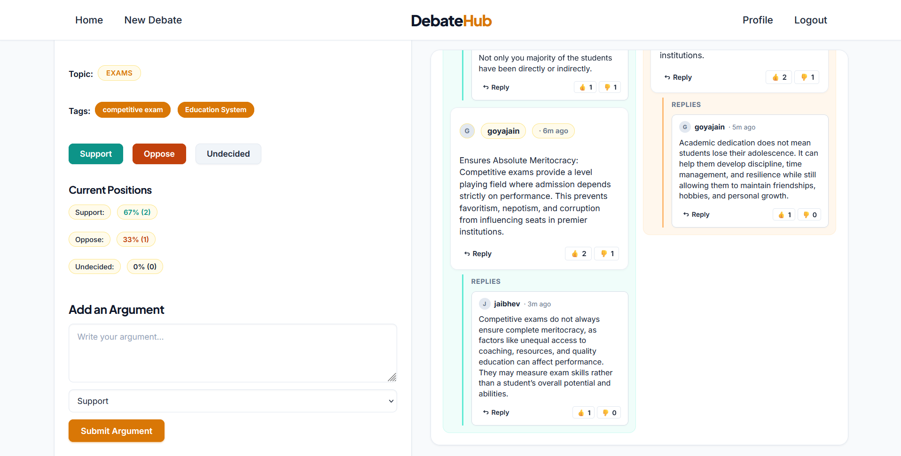
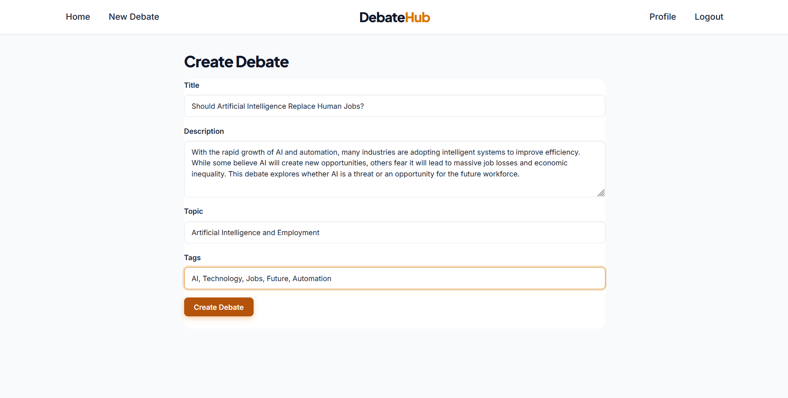

# DebateHub

A modern, client-side Single Page Application (SPA) designed to foster structured, balanced, and productive online debates. Built purely with Vanilla JavaScript, HTML5, and CSS3, DebateHub eliminates the noise and chaos of conventional comment sections by organizing arguments into categorized viewpoints, user stances, and nested community discussions.

---

## Project Overview

**DebateHub** is an interactive debate and discussion platform where users can express their stances, construct reasoned arguments, and engage in constructive dialogue. 

Unlike traditional forums where discussions quickly devolve into unstructured comment threads, DebateHub provides a purpose-built environment that separates opposing viewpoints into clear perspectives. Users can register an account, create debates on diverse topics, cast stance votes (Support, Oppose, Undecided), submit categorized arguments, engage in threaded replies, and evaluate contributions through community voting.

---

## Problem Statement

Modern social media platforms and discussion boards frequently suffer from unstructured, chaotic debates characterized by:
- **Disorganized Comment Sections**: Complex arguments become buried under endless, linear comment feeds where context is easily lost.
- **Echo Chambers and Polarized Noise**: Polarizing statements often drown out nuanced or counter-arguments, making it hard to see the broader picture.
- **Lack of Stance Clarity**: Readers cannot easily gauge the community's overall consensus or understand the distribution of opinions on a topic.
- **Shallow Engagement**: Without clear categorization (support vs. opposition), debates often degrade into personal attacks rather than topic-focused discussions.

### How DebateHub Solves This:
- **Dedicated Perspective Columns**: Arguments are explicitly organized into dedicated **Supportive** and **Opposing** columns, allowing readers to examine both sides equally.
- **Measurable Stances**: Users select their overarching position (**Support**, **Oppose**, or **Undecided**), with real-time percentage indicators providing an instant snapshot of community sentiment.
- **Threaded Discourse**: Direct replies are nested under specific arguments, ensuring counter-points stay tethered to their original context.
- **Quality-Driven Feedback**: Upvoting and downvoting on arguments and replies highlight thoughtful, persuasive contributions.

---

## Goals and Objectives

- **Structured Debates**: Provide clear structural guardrails so every topic is debated within an organized framework rather than an unmoderated free-for-all.
- **Organized Arguments**: Separate constructive arguments by viewpoint side (Support vs. Oppose) to facilitate objective reading and side-by-side analysis.
- **Multiple Perspectives**: Give equal visibility to opposing and supporting viewpoints, alongside capturing undecided stances, preventing single-narrative dominance.
- **User Participation**: Encourage thoughtful, community-driven civic discourse through stance taking, argument posting, inline editing, and two-way voting mechanisms.

---

## Features

DebateHub contains only fully implemented, client-side features:

### Authentication
- **Register**: Create a new account with a unique username, password, and either an email or phone number.
- **Login**: Authenticate using registered email/phone credentials and password.
- **Logout**: Instantly terminate the active session and return to guest mode.
- **Persistent User State**: User sessions, registered accounts, and active authorizations persist across page reloads via browser `localStorage`.

### Debates
- **Create Debates**: Authenticated users can publish new debates with a title, detailed description, topic category, and comma-separated tags.
- **Read/View Debates**: Explore all available debates on the home page via responsive debate cards, or open any debate room (`/debate/:id`) to review detailed descriptions, tags, stance metrics, and arguments.
- **Update Debates**: Authors can edit their own debate title, description, topic, and tags directly within the debate control panel.
- **Delete Debates**: Authors can permanently delete their own debate. The system executes a cascading cleanup, removing all associated arguments, nested responses, stance positions, and cast votes.

### Arguments
- **Add Arguments**: Authenticated participants can submit reasoned arguments classified under either **Support** or **Oppose**.
- **Support / Oppose / Undecided Positions**: Users can declare their overall stance on any debate. The platform aggregates these stances and dynamically displays percentage statistics.
- **Edit Arguments**: Authors can modify their submitted argument content and toggle their argument side between Support and Oppose.
- **Voting System**: Community members can cast an **Upvote** or **Downvote** on any argument, with live tally updates and duplicate-vote prevention per user.

### Responses
- **Reply to Arguments**: Users can post direct, targeted replies to any specific argument using an expandable reply panel.
- **Nested Discussions**: Responses render hierarchically directly under the parent argument thread card with author names, and timestamps.
- **Response Voting**: Nested responses feature independent upvote and downvote counters, enabling the community to evaluate replies on their own merits.

---

## Tech Stack

- **HTML5**: Semantic document structure (`<header>`, `<nav>`, `<main>`, `<article>`, `<section>`, `<details>`).
- **CSS3**: Custom design system built with CSS Custom Properties (variables), Flexbox, CSS Grid layouts, and responsive media queries.
- **JavaScript (ES6+)**: Modular client-side architecture using ES Modules (`import`/`export`), HTML5 History API, event delegation, and DOM manipulation.
- **Browser LocalStorage**: Persistent client-side data store for users, debates, arguments, responses, positions, and votes without external database dependencies.

---

## Application Architecture

DebateHub is built as a single-page application (SPA). Instead of requesting multiple HTML pages from a web server, the application loads a single page (`index.html`) once. All subsequent page transitions, view rendering, and state updates are handled dynamically on the client side using JavaScript.

### SPA Execution Flow

```
index.html
      |
      ↓
app.js
      |
      ↓
router.js
      |
      ↓
ui.js
      |
      ↓
style.css
```

### Flow Breakdown:
1. **`index.html`**: The static HTML entry point containing the `<header>`, `<nav id="navbar">`, and the dynamic root `<main id="app">`. Loads `app.js` as an ES module.
2. **`app.js`**: The central controller and event orchestrator:
   - Initializes and restores application state from `localStorage` via `loadState()`.
   - Intercepts link clicks (`[data-link]`) and manages browser history through `window.history.pushState` and `popstate` listeners.
   - Delegates global click and submit events for authentication, debate management, argument posting, voting, and editing.
   - Coordinates re-renders by executing `render()`.
3. **`router.js`**: Client-side URL router:
   - Reads `window.location.pathname` to identify the requested route.
   - Enforces authentication route guards (`requireAuth`) for protected paths (e.g., `/create`, `/profile`).
   - Resolves dynamic routes such as `/debate/:id`.
   - Returns the corresponding template string for the matching view.
4. **`ui.js`**: Declarative UI rendering module:
   - Produces HTML template strings for all views (`renderHome`, `renderLogin`, `renderRegister`, `renderProfile`, `renderCreateDebate`, `renderDebate`, `renderNotFound`, `renderNavbar`).
   - Sanitizes user-submitted content with `escapeHTML()` to prevent Cross-Site Scripting (XSS).
   - Formats relative timestamps and calculates stance/vote distributions.
5. **`style.css`**: Global design stylesheet defining design tokens (colors, typography, spacing, shadows), component layout grids, debate room split-panels, and interactive states.

---

## Folder Structure

```
DebateHub/
├── .gitignore
├── favicon.ico
├── index.html
├── landing.html
├── landing.css
├── README.md
├── css/
│   └── style.css
└── js/
    ├── app.js
    ├── arguments.js
    ├── auth.js
    ├── debates.js
    ├── positions.js
    ├── responses.js
    ├── router.js
    ├── state.js
    ├── storage.js
    ├── ui.js
    └── votes.js
```

### Module Responsibilities:
- **`index.html`**: Host page containing the root navigation and application mounts.
- **`css/style.css`**: Complete styling, CSS variables, layout components, and design system.
- **`js/app.js`**: Application bootstrapping, global event delegation, and main render pipeline.
- **`js/arguments.js`**: Argument creation, side validation, and author editing logic.
- **`js/auth.js`**: User registration, credential verification, and session state handling.
- **`js/debates.js`**: Debate CRUD operations and cascading deletion routines.
- **`js/positions.js`**: User debate stance assignment (Support/Oppose/Undecided) and percentage calculations.
- **`js/responses.js`**: Threaded response creation attached to parent arguments.
- **`js/router.js`**: Path matching, route guards, and view resolution.
- **`js/state.js`**: Centralized reactive state store definition.
- **`js/storage.js`**: Serialization and retrieval of state to and from `localStorage`.
- **`js/ui.js`**: View rendering functions, HTML escaping, and UI components.
- **`js/votes.js`**: Argument and response voting handlers and tally statistics.

---

## Setup Instructions

### Prerequisites
- A modern web browser supporting ES6 Modules (Google Chrome, Mozilla Firefox, Microsoft Edge, Safari).
- A local static file web server (e.g., VS Code Live Server, Python HTTP server, or Node `serve`/`http-server`).  
  *Note: Because ES modules (`type="module"`) are subject to browser CORS policies, opening `index.html` via `file:///` is not supported.*

### Step 1: Clone the Repository
```bash
git clone https://github.com/mrjd-byte/DebateHub.git
```

### Step 2: Open the Project
Navigate into the project directory:
```bash
cd DebateHub
```

### Step 3: Run Using a Local Server

#### Option A: VS Code Live Server (Recommended)
1. Open the `DebateHub` folder in Visual Studio Code.
2. Install the **Live Server** extension by Ritwick Dey.
3. Right-click on `index.html` and select **Open with Live Server** (or click "Go Live" in the status bar).
4. Live Server will serve the project at `http://127.0.0.1:5500`.

#### Option B: Python HTTP Server
If Python 3 is installed:
```bash
python -m http.server 8000
```
Open your browser and navigate to `http://localhost:8000`.

#### Option C: Node.js `npx serve`
If Node.js is installed:
```bash
npx serve .
```
Open your browser at the URL shown in the terminal.

---

## Screenshots

### Landing Page

Modern landing page introducing DebateHub, explaining the problem, solution, features, workflow, and providing entry into the application.

<div align="center">



</div>

<br/>

<div align="center">



</div>

<br/>

<div align="center">



</div>

---

### Debate Feed / Home Page

Main debate discovery page displaying available debates with topic information and descriptions.

<div align="center">



</div>

---

### Debate Details Page

Detailed debate view showing debate information, stance selection, community responses, nested replies, and voting interactions.

<div align="center">



</div>

<br/>

<div align="center">



</div>

---

### Create Debate

Interface for users to create new debates with title, description, topics, and tags.

<div align="center">



</div>

---

## Future Improvements

The following improvements reflect realistic next steps for evolving DebateHub into a full-scale production system:

- **Backend Integration**: Replace pure client-side orchestration with a secure REST or GraphQL backend API (e.g., Node.js/Express, Python/FastAPI, or Go).
- **Database Persistence**: Migrate from client browser `localStorage` to a persistent database (PostgreSQL, MongoDB) with password hashing (bcrypt/argon2) and JWT/session management.
- **User Profiles**: Expand user profiles to display user activity histories, debate participation records, earned debate badges, and avatar management.
- **Search and Filtering**: Complete the search module with full-text search across titles, descriptions, and tags, alongside sorting by popularity, recent activity, or controversy.
- **Notifications**: Implement real-time or inbox notifications when users reply to an argument or when a followed debate receives new activity.

---

## Development Guidelines

To maintain code quality and project consistency:

- **Clean Folder Organization**: Keep modular separations clean. JavaScript domain logic resides in dedicated files under `js/`, styling rules remain in `css/`, and views are modularized in `ui.js`.
- **Meaningful Commits**: Write clear, descriptive commit messages adhering to conventional commit standards (e.g., `feat: implement argument voting`, `fix: cascade delete response votes on debate deletion`).
- **No Sensitive Information Committed**: Never commit sensitive secrets, private credentials, or environment files (`.env`). Even though the current app uses browser `localStorage`, ensure simulated authentication data and secrets are never committed to version control.
